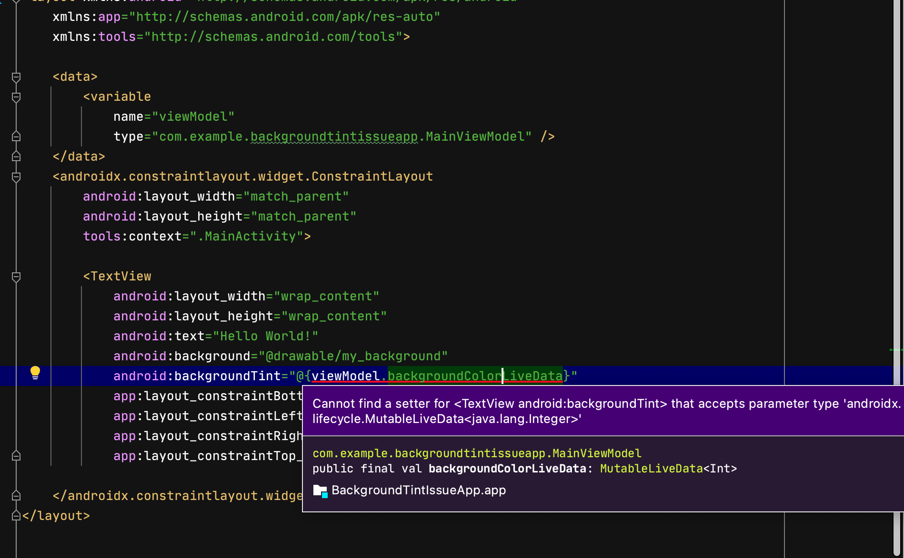
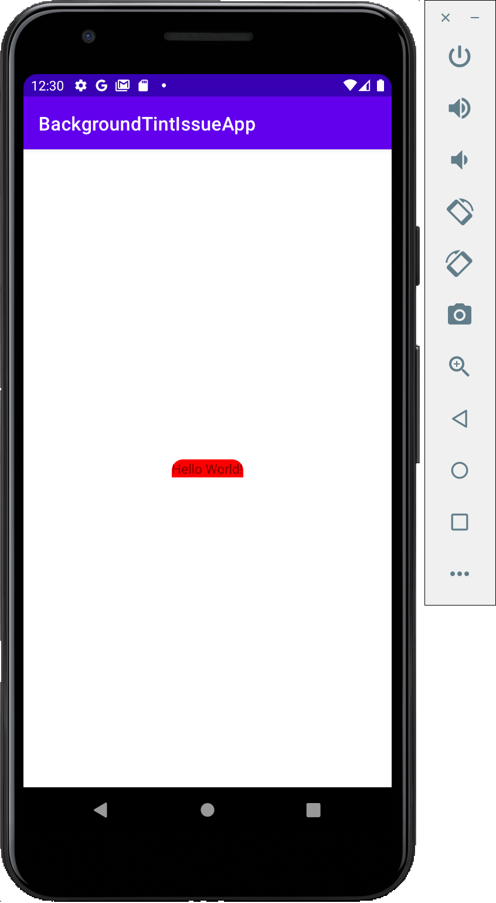

This project demonstrates an issue with Android Studio showing a warning about a databinding feature that works

Steps to reproduce:
* Open the project in Android Studio
* Open the file `activity_main.xml`
* Expected behavior: No error appears
* ⚠️ Actual behavior: An error appears about the `android:backgroundTint` attribute:
    > Cannot find a setter for <TextView android:backgroundTint> that accepts parameter type 'androidx.lifecycle.MutableLiveData<java.lang.Integer>'
    
* Install the app to a device
* Expected behavior: the button appears with the custom shape, tinted red
* Actual behavior: it works as expected:

    

Note:
In the generated databinding file, `./app/build/generated/source/kapt/debug/com/example/backgroundtintissueapp/databinding/ActivityMainBindingImpl.java`, the code supports converting the `LiveData`'s `Int` to a `ColorStateList`:
```java
    this.mboundView1.setBackgroundTintList(androidx.databinding.adapters.Converters.convertColorToColorStateList(viewModelBackgroundColorLiveDataGetValue));
```
